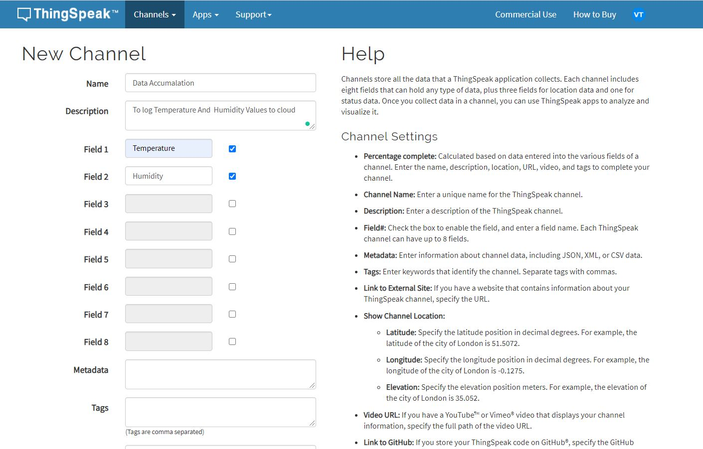
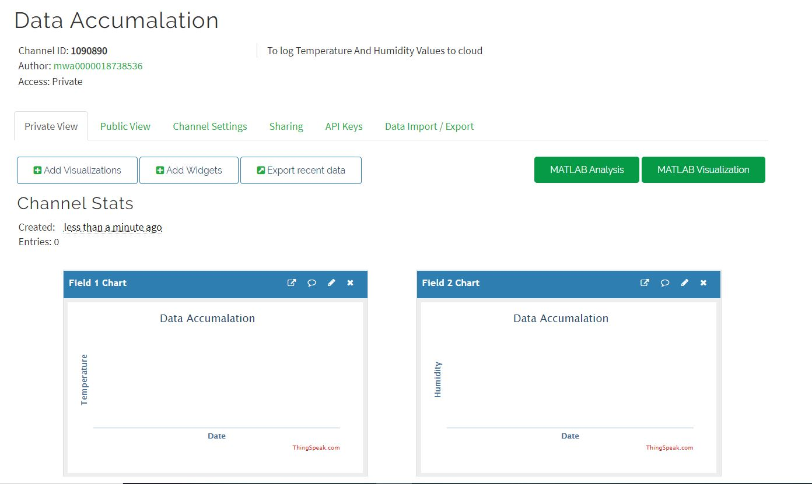
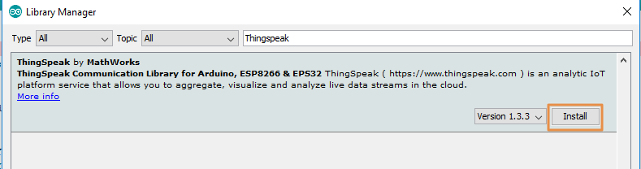

# IoT-Fdp-documentation
IoT Documentation
This is all about iot documentation and all the things that you learn in the training sessions

## What is IOT?
IoT is simply the network of interconnected things/devices which are embedded with sensors, software, network connectivity and necessary electronics that enables them to collect and exchange data making them responsive.
## IOT Uses
    Everyday Life
    Health Care
    Agriculture
    Industrial Automation
    Disaster management
    Smart cities
## The things that we are used in this sessions:
Led,LDR,Servo Motor,LCD,MIT,Thingspeak,Blynk,Cloud.
# LED
    A light-emitting diode (LED) is a semiconductor light source that emits light when current flows through it. Electrons in the semiconductor recombine with electron holes, releasing energy in the form of photons. The color of the light (corresponding to the energy of the photons) is determined by the energy required for electrons to cross the band gap of the semiconductor.[5] White light is obtained by using multiple semiconductors or a layer of light-emitting phosphor on the semiconductor device.
## How does the Light Emitting Diode work?
    The light emitting diode simply, we know as a diode. When the diode is forward biased, then the electrons &
holes are moving fast across the junction and they are combining constantly, removing one another out. Soon
after the electrons are moving from the n-type to the p-type silicon, it combines with the holes, then it
disappears. Hence it makes the complete atom & more stable and it gives the little burst of energy in the form
of a tiny packet or photon of light.
## Symbol of an LED:

## I-V characteristics:
    There are different types of light emitting diodes are available in the market and there are different LED
characteristics which include the color light, or wavelength radiation, light intensity. The important
characteristic of the LED is color. In the starting use of LED, there is the only red color. As the use of LED is
increased with the help of the semiconductor process and doing the research on the new metals for LED, the
different colors were formed.

## Types of LED'S
    Through hole LED
    SMD LED
    Bi colour LED
    Tri colour LED(RGB)
# Arduino
        The Arduino UNO is the best board to get started with electronics and coding. If this is your first experience tinkering with       the platform, the UNO is the most robust board you can start playing with. The UNO is the most used and documented board of the         whole Arduino family.
    
## Installing on Arduino software:

### Arduino with LED
    int led=13;
    void main()
    {
    pinMode(led,13);
    }
    void loop()
    {
    digitalWrite(13,HIGH);
    delay(500);
    digitalWrite(13,LOW);
    delay(500);
    }

# LDR
    A photoresistor (acronymed LDR for Light Decreasing Resistance, or light-dependent resistor, or photo-conductive cell) is a passive component that decreases resistance with respect to receiving luminosity (light) on the component's sensitive surface. The resistance of a photoresistor decreases with increase in incident light intensity; in other words, it exhibits photoconductivity. A photoresistor can be applied in light-sensitive detector circuits and light-activated and dark-activated switching circuits acting as a resistance semiconductor. In the dark, a photoresistor can have a resistance as high as several megaohms (MΩ), while in the light, a photoresistor can have a resistance as low as a few hundred ohms. If incident light on a photoresistor exceeds a certain frequency, photons absorbed by the semiconductor give bound electrons enough energy to jump into the conduction band. The resulting free electrons (and their hole partners) conduct electricity, thereby lowering resistance. The resistance range and sensitivity of a photoresistor can substantially differ among dissimilar devices. Moreover, unique photoresistors may react substantially differently to photons within certain wavelength bands.
    
    int ldr=A0;
    int led=2;
    void setup() {
    pinMode(ldr,INPUT);
    pinMode(led,OUTPUT);
    Serial.begin(9600);// put your setup code here, to run once:
    }
    void loop() {
    int value=analogRead(ldr);
    Serial.println(value);
    if(value<100)
    {
    digitalWrite(led,1);
    }
    else
    {
    digitalWrite(led,0);
    }
    }

## Button

    int led=5;
    int button=6;
    void setup()
    {
    pinMode(5,OUTPUT);
    pinMode(6,INPUT);
    }
    void loop()
    {
    a=digitalRead(6);
    if(a==1)
    {
    digitalWrite(5,1);
    }
    else
    {
    digitalWrite(5,0);
    }
    }

## Servo Motor

    A servomotor is a rotary actuator or linear actuator that allows for precise control of angular or linear position, velocity and acceleration.[1] It consists of a suitable motor coupled to a sensor for position feedback. It also requires a relatively sophisticated controller, often a dedicated module designed specifically for use with servomotors.
Servomotors are not a specific class of motor, although the term servomotor is often used to refer to a motor suitable for use in a closed-loop control system.Servomotors are used in applications such as robotics, CNC machinery or automated manufacturing.

    #include<Servo.h>
    Servo myservo;
    void setup() {
    myservo.attach(3);
    }
    void loop() 
    {
    myservo.write(0);
    delay(1000);
    myservo.write(90);
    delay(1000);
    myservo.write(180);
    delay(1000);
    }

# Ultra Sonic Sensor

An ultrasonic sensor is an electronic device that measures the distance of a target object by emitting ultrasonic sound waves, and converts the reflected sound into an electrical signal. Ultrasonic waves travel faster than the speed of audible sound (i.e. the sound that humans can hear). Ultrasonic sensors have two main components: the transmitter (which emits the sound using piezoelectric crystals) and the receiver (which encounters the sound after it has travelled to and from the target).
In order to calculate the distance between the sensor and the object, the sensor measures the time it takes between the emission of the sound by the transmitter to its contact with the receiver. The formula for this calculation is D = ½ T x C (where D is the distance, T is the time, and C is the speed of sound ~ 343 meters/second). For example, if a scientist set up an ultrasonic sensor aimed at a box and it took 0.025 seconds for the sound to bounce back, the distance between the ultrasonic sensor and the box would be:
D = 0.5 x 0.025 x 343

    int trigger=2;
    int echo=4;
    void setup() 
    {
    pinMode(2,OUTPUT);
    pinMode(4,INPUT);
    Serial.begin(9600);
    }
    void loop() 
    {
    digitalWrite(2,LOW);
    delayMicroseconds(2);
    digitalWrite(2,HIGH);
    delayMicroseconds(10);
    digitalWrite(2,LOW);
    long duration=pulseIn(4,HIGH);
    float distance=0.034*duration/2;
    Serial.println(distance);
    delay(1000);
    }

# LCD

# ThingsSpeack Cloud:
ThingSpeak is an Open-Source IoT application and API to store and retrieve data from Hardware devices and Sensors. It uses HTTP Protocol over the Internet or LAN for its communication. The MATLAB analytics is included to analyze and visualize the data received from your Hardware or Sensor Devices.

We can create channels for each and every sensor data. These channels can be set as private channels or you can share the data publically through Public channels. The commercial features include additional features. But we will be using the free version as we doing it for educational purpose.

You can make projects like Weather Station, Tide Prediction, Counter and Many More.
### Features
1. Collect data in private channels.
2. Share Data with Public Channels
3. REST API and MQTT APIS
4. MATLAB® Analytics and Visualizations.
5. Worldwide Community
 In this we  will be using a DHT11 to plot its Temperature and Humidity on ThingSpeak using NodeMCU. We will program the NodeMCU to read and store the DHT data into a variable and then upload it to ThingSpeak using its channel name and API key. The NodeMCU should be connected to the internet via Wi-Fi. We will see how to create ThingSpeak Channels and configure it on NodeMCU.
### Hardware Required:
1.NodeMCU
2.DHT11 Sensor
3.10K Ohm Resistor
4.Jumper Wires
5.Breadboard (Optional)
### Circuit Diagram:

Once the hardware is set up, We can go ahead and create our ThingSpeak Channel.

Step 1: Go to https://thingspeak.com/ and create your ThingSpeak Account if you don’t have. Login to Your Account.

Step 2: Create a Channel by clicking ’New Channel’.

Step 3: Enter the channel details.

Name: Any Name

Description: Optional

Field 1: Temperature DHT11 – This will be displayed on the analytics graph. If you need more than 1 Channels you can create for additional Sensor Data.
Field 2: Humidity DHT11 – This will be displayed on the analytics graph. If you need more than 1 Channels you can create for additional Sensor Data.

Save this setting.

Step 4: Now you can see the channels. Click on the ‘API Keys’ tab. Here you will get the Channel ID and API Keys. Note this down.

Step 5: Open Arduino IDE and Install the ThingSpeak Library. To do this go to Sketch>Include Library>Manage Libraries. Search for ThingSpeak and install the library.

Step 6: Now we need to modify the program with your credentials.

In the below code you need to change your Network SSID, Password and your ThingSpeak Channel and API Keys.

Replace the following content in the code,

‘Your SSID Here’ – Your Wi-Fi Name

‘Your Password Here’ – Your Wi-Fi Password

‘YYYYYY’ – Your ThingSpeak Channel Number (without Quotes)

‘XXXXXXXXXXX’ – Your Thing Speak API Key.
### Code
'''c
#include "DHT.h"
#include <ESP8266WiFi.h>
#define DHTPIN D2    
#include <ESP8266HTTPClient.h>
#define DHTTYPE DHT11
WiFiClient client;
DHT dht(DHTPIN, DHTTYPE);
String thingSpeakAddress= "http://api.thingspeak.com/update?";
String writeAPIKey;
String tsfield1Name;
String request_string;

HTTPClient http;

void setup()
{
  Serial.begin(9600);
  Serial.println("Connecting to the Wifi");
   WiFi.begin("Wifi","12345678");
  while ((!(WiFi.status() == WL_CONNECTED))){
    delay(300);
    Serial.print("....");

  }
  Serial.println("Successfully Connected to Wifi Network");
  dht.begin();
}

void loop()
{
  float h = dht.readHumidity();
  float t = dht.readTemperature();
  Serial.println(h);
  Serial.println(t);
    if (client.connect("api.thingspeak.com",80)) {
      request_string = thingSpeakAddress;
      request_string += "key=";
      request_string += "W2ZC1MSOHFQGTUR7";
      request_string += "&";
      request_string += "field1";
      request_string += "=";
      request_string += t;
      Serial.println("Publishing temperature value");
      Serial.print(t);
      http.begin(request_string);
      http.GET();
      http.end();

    }
    if (client.connect("api.thingspeak.com",80)) {
      request_string = thingSpeakAddress;
      request_string += "key=";
      request_string += "W2ZC1MSOHFQGTUR7";
      request_string += "&";
      request_string += "field2";
      request_string += "=";
      request_string += h;
      Serial.println("Publishing Humidity value");
      Serial.print(h);
      http.begin(request_string);
      http.GET();
      http.end();

    }

} '''
